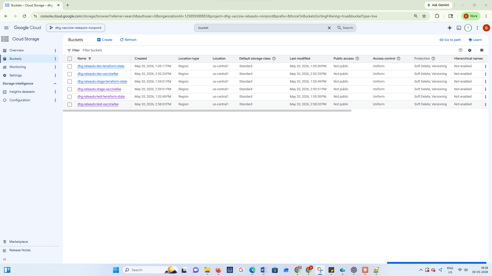

<div align="center">


# 🪣 dhg-rateauto-tf-gcs-buckets

### Terraform · Google Cloud Storage · Enterprise Bucket Provisioning
### DHG Rate Automation Platform - `dhg-vaccine-rateauto-nonpord`

[](https://www.terraform.io)
[](https://cloud.google.com/storage)
[](https://registry.terraform.io/providers/hashicorp/google/latest)
[](https://developer.hashicorp.com/terraform/language)
[](https://cloud.google.com/iam/docs/workload-identity-federation)
[]()

---

*Provisions enterprise-grade Google Cloud Storage buckets with autoclass, versioning, soft delete, hierarchical namespace, dynamic lifecycle rules, mandatory org-policy labels, and conditional IAM bindings - fully reusable across all DHG environments.*

</div>

---

## 📋 Table of Contents

- [Overview](#-overview)
- [UI Gallery](#-ui-gallery)
- [Why This Module Exists](#-why-this-module-exists)
- [Architecture](#-architecture)
- [Repository Structure](#-repository-structure)
- [Prerequisites](#-prerequisites)
- [Resources Created](#-resources-created)
- [File-by-File Breakdown](#-file-by-file-breakdown)
- [Features Deep Dive](#-features-deep-dive)
- [Variables Reference](#-variables-reference)
- [Outputs Reference](#-outputs-reference)
- [Lifecycle Rules](#-lifecycle-rules)
- [IAM Bindings with CEL Conditions](#-iam-bindings-with-cel-conditions)
- [Mandatory Organisation Labels](#-mandatory-organisation-labels)
- [Environments](#-environments)
- [Usage](#-usage)
- [CI/CD Pipeline](#-cicd-pipeline)
- [Security](#-security)
- [Provider Versions](#-provider-versions)
- [Related Repositories](#-related-repositories)

---

## 🌐 Overview

This repository provisions **Google Cloud Storage (GCS) buckets** for the DHG Rate Automation platform using Terraform. It is designed as a **fully reusable, environment-agnostic module** - the same Terraform code provisions buckets for dev, stage, and prod by simply switching the `.tfvars` file.

The module enforces **enterprise defaults** out of the box:
- 🚫 **No public access** - `public_access_prevention = enforced` by default
- 🔒 **Uniform bucket-level access** - IAM-only, no per-object ACLs
- 🏷️ **Mandatory org-policy labels** - `aide-id`, `environment`, `service-tier` required by GCP org policy
- 🔄 **Dynamic lifecycle rules** - fully configurable object transition and deletion policies
- 🛡️ **Conditional IAM bindings** - role assignments with optional CEL expression conditions

This repo is **independent** of the GKE and VPC repos - it can be deployed at any point in the infrastructure lifecycle.

### 🔑 Key Facts

| Property | Value |
|---|---|
| ☁️ **Service** | Google Cloud Storage |
| 🌍 **Default Region** | `us-central1` |
| 🔒 **Public Access** | `enforced` (blocked by default) |
| 🔑 **Access Control** | Uniform Bucket Level Access (IAM only) |
| 🏷️ **Labels Required** | `aide-id`, `environment`, `service-tier` |
| 🔄 **Lifecycle Rules** | Fully dynamic via variables |
| 🛡️ **IAM** | Conditional role bindings with CEL support |
| 💾 **Soft Delete** | 7–90 days retention window |
| 📦 **Versioning** | Optional, configurable |
| 🤖 **Autoclass** | Optional, automatic storage class management |

---

## 🖼️ UI Gallery

> 📌 **Note:** All images are stored in `docs/gallery/`. Upload your screenshots there to display them here.

### 🪣 GCS Bucket - GCP Console View


---


## 💡 Why This Module Exists

Rather than creating GCS buckets manually in the GCP Console (which leads to inconsistent configurations, missing labels, and security gaps), this Terraform module ensures **every bucket** across all environments is provisioned with the same enterprise standards.

### Problems Solved

| Problem | Solution |
|---|---|
| Buckets created without mandatory labels | Org-policy labels enforced in every `apply` |
| Public access accidentally enabled | `public_access_prevention = enforced` as default |
| Per-object ACLs bypassing IAM | Uniform bucket-level access always enabled |
| No lifecycle rules → storage cost grows | Dynamic lifecycle rules - transition or delete by age |
| No versioning → accidental deletion is permanent | Soft delete + optional versioning |
| IAM roles granted without conditions | CEL expression support for fine-grained ABAC |
| Manual bucket creation is not repeatable | Infrastructure as Code - apply same config to any env |

---

## 🏛️ Architecture

```
┌────────────────────────────────────────────────────────────────────┐
│                   GitHub Actions CI/CD Pipeline                     │
│                 (Workload Identity Federation)                       │
│         No JSON keys - short-lived OIDC tokens only                │
└──────────────────────────┬─────────────────────────────────────────┘
                           │ terraform apply
                           ▼
┌────────────────────────────────────────────────────────────────────┐
│                  Terraform >= 1.4                                   │
│             google provider < 6.11.0                               │
│           Remote state: GCS bucket (dhg-rateauto-tf-state)        │
└──────────┬────────────────────────────────────────┬───────────────┘
           │                                        │
           ▼                                        ▼
┌──────────────────────────┐          ┌─────────────────────────────┐
│  google_storage_bucket    │          │  google_storage_bucket_     │
│  .default                 │          │  iam_binding.default        │
│                           │          │                             │
│  ✅ Uniform access        │          │  for_each = role map        │
│  ✅ Public prevention     │          │  ├── role                   │
│  ✅ Autoclass (optional)  │          │  ├── members list           │
│  ✅ Hierarchical NS       │          │  └── CEL conditions         │
│  ✅ Versioning            │          │      (optional)             │
│  ✅ Soft delete (7-90d)   │          └─────────────────────────────┘
│  ✅ Mandatory labels      │
│  ✅ Dynamic lifecycle     │
│     rules                 │
└──────────────────────────┘
```

---

## 📁 Repository Structure

```
dhg-rateauto-tf-gcs-buckets/
│
├── 📁 .github/
│   └── 📁 workflows/
│       └── 📄 terraform.yml          # CI/CD: plan on PR, apply on merge
│
├── 📁 environments/
│   ├── 📄 dev.tfvars                 # Dev bucket configuration
│   ├── 📄 stage.tfvars               # Stage bucket configuration
│   └── 📄 prod.tfvars                # Prod bucket configuration
│
├── 📄 main.tf                        # GCS bucket + IAM binding resources
├── 📄 variables.tf                   # 17 input variables (180 lines)
├── 📄 outputs.tf                     # bucket_name output
├── 📄 providers.tf                   # Google provider configuration
├── 📄 terraform.tf                   # GCS remote state backend
├── 📄 versions.tf                    # Terraform + provider version constraints
└── 📄 README.md                      # This file
```

---

## ✅ Prerequisites

| Requirement | Details |
|---|---|
| 🔧 **Terraform** | `>= 1.4` |
| ☁️ **Google Provider** | `< 6.11.0` |
| 📁 **GCP Project** | `dhg-vaccine-rateauto-nonpord` |
| 🔌 **APIs enabled** | `storage.googleapis.com`, `iam.googleapis.com` |
| 🔐 **IAM permissions** | `roles/storage.admin`, `roles/resourcemanager.projectIamAdmin` |
| 🔑 **Authentication** | WIF via GitHub Actions (CI/CD) or `gcloud auth application-default login` (local) |
| 🏷️ **Org Policy** | `custom.enforceLabelsCloudStorageBuckets` - labels `aide-id`, `environment`, `service-tier` must be set |

Enable required APIs:

```bash
gcloud services enable storage.googleapis.com iam.googleapis.com \
  --project=dhg-vaccine-rateauto-nonpord
```

---

## 📦 Resources Created

| # | Resource | Terraform Name | Description |
|---|---|---|---|
| 1 | `google_storage_bucket` | `default` | The GCS bucket with all enterprise features |
| 2 | `google_storage_bucket_iam_binding` | `default` | Conditional IAM role bindings (created only if `assign_role_iam_binding = true`) |

**Total: 1–2 resources** per environment (IAM binding is optional).

---

## 🔍 File-by-File Breakdown

### 📄 `main.tf` - Core Resources (77 lines)

Two resource blocks that do all the heavy lifting:

#### Block 1 - GCS Bucket

```hcl
resource "google_storage_bucket" "default" {
  name                        = var.bucket_name
  location                    = var.region
  project                     = var.project_id
  storage_class               = var.storage_class
  uniform_bucket_level_access = true              # Always enforced
  public_access_prevention    = var.public_access_prevention  # "enforced"

  autoclass {
    enabled = var.enable_autoclass
  }

  hierarchical_namespace {
    enabled = var.enable_hierarchical_namespace
  }

  versioning {
    enabled = var.enable_versioning
  }

  soft_delete_policy {
    retention_duration_seconds = var.retention_duration_seconds
  }

  labels = {
    aide-id      = var.aide_id
    environment  = var.environment
    service-tier = var.service_tier
  }

  dynamic "lifecycle_rule" {
    for_each = var.lifecycle_rules
    content {
      action {
        type          = lifecycle_rule.value.action_type
        storage_class = lifecycle_rule.value.action_type == "SetStorageClass"
                        ? lifecycle_rule.value.storage_class : null
      }
      condition {
        age                                  = lifecycle_rule.value.days
        send_age_if_zero                     = lifecycle_rule.value.send_age_if_zero
        created_before                       = lifecycle_rule.value.created_before != "" ? lifecycle_rule.value.created_before : null
        with_state                           = lifecycle_rule.value.with_state != "" ? lifecycle_rule.value.with_state : null
        matches_storage_class                = lifecycle_rule.value.matches_storage_class != "" ? lifecycle_rule.value.matches_storage_class : null
        matches_prefix                       = lifecycle_rule.value.matches_prefix != [] ? lifecycle_rule.value.matches_prefix : null
        matches_suffix                       = lifecycle_rule.value.matches_suffix != [] ? lifecycle_rule.value.matches_suffix : null
        num_newer_versions                   = lifecycle_rule.value.num_newer_versions != "" ? lifecycle_rule.value.num_newer_versions : null
        days_since_noncurrent_time           = lifecycle_rule.value.days_since_noncurrent_time != 0 ? lifecycle_rule.value.days_since_noncurrent_time : null
        noncurrent_time_before               = lifecycle_rule.value.noncurrent_time_before != "" ? lifecycle_rule.value.noncurrent_time_before : null
        # ... more conditions
      }
    }
  }
}
```

#### Block 2 - IAM Bindings with CEL Conditions

```hcl
resource "google_storage_bucket_iam_binding" "default" {
  for_each = var.assign_role_iam_binding ? var.role_member_conditions : {}

  bucket  = google_storage_bucket.default.name
  role    = each.value.role
  members = each.value.members

  dynamic "condition" {
    for_each = each.value.conditions
    content {
      title       = condition.value.title
      description = condition.value.description
      expression  = condition.value.expression   # CEL expression
    }
  }
}
```

The `for_each = var.assign_role_iam_binding ? var.role_member_conditions : {}` pattern means IAM bindings are **only created when explicitly requested** - safe by default.

---

### 📄 `variables.tf` - 17 Input Variables (180 lines)

The most comprehensive file - covers bucket identity, features, lifecycle, labels, and IAM. Includes inline commented examples for both lifecycle rules and IAM conditions directly in the file for quick reference.

---

### 📄 `outputs.tf` - Single Output (4 lines)

```hcl
output "bucket_name" {
  description = "The name of the created bucket."
  value       = google_storage_bucket.default.name
}
```

Simple and purposeful - the bucket name is what downstream modules need to reference for object operations.

---

### 📄 `versions.tf` - Version Constraints

```hcl
terraform {
  required_version = ">= 1.4"
  required_providers {
    google = {
      source  = "hashicorp/google"
      version = "< 6.11.0"
    }
  }
}
```

The upper bound `< 6.11.0` is a **deliberate pinning** - the Google provider 6.x series introduced breaking changes in resource schemas. This ensures consistent behavior until the upgrade is explicitly tested and approved.

---

### 📄 `providers.tf` - Provider Configuration

```hcl
provider "google" {
  project = var.project_id
  region  = var.region
}
```

Minimal provider block - no hardcoded credentials. Authentication is handled entirely by WIF in CI/CD and by ADC locally.

---

## 🚀 Features Deep Dive

### 🔒 1. Uniform Bucket Level Access

```hcl
uniform_bucket_level_access = true
```

**Always enabled, cannot be disabled via variables.** This means:
- All access is controlled through IAM policies only
- Legacy per-object ACLs are disabled
- Simpler, more auditable security model
- Required for many GCP org policies

---

### 🚫 2. Public Access Prevention

```hcl
public_access_prevention = var.public_access_prevention  # default: "enforced"
```

| Value | Behaviour |
|---|---|
| `"enforced"` ✅ | No public access possible - even if someone tries to set `allUsers` IAM |
| `"inherited"` | Follows the org policy (may allow public in some orgs) |

**Always use `enforced`** for any bucket containing application data, backups, or logs.

---

### 🤖 3. Autoclass

```hcl
autoclass {
  enabled = var.enable_autoclass  # default: false
}
```

When enabled, GCS **automatically moves objects** to the most cost-effective storage class based on how frequently they are accessed:

```
Frequently accessed  → STANDARD       (no change)
Infrequently accessed → NEARLINE      (~30 days idle)
Rarely accessed      → COLDLINE       (~90 days idle)
Archived             → ARCHIVE        (~365 days idle)
```

**When to enable:** Long-term storage buckets, backup buckets, or any bucket where access patterns are mixed or unpredictable. Not ideal for application data buckets with high-frequency access.

---

### 🗂️ 4. Hierarchical Namespace

```hcl
hierarchical_namespace {
  enabled = var.enable_hierarchical_namespace  # default: false
}
```

Enables **folder-like semantics** in the bucket - similar to a traditional file system. Required for:
- BigQuery Omni cross-cloud analytics
- Dataproc / Dataflow jobs that expect directory structures
- Analytics workloads needing atomic directory operations
- POSIX-compatible file operations

> ⚠️ Hierarchical namespace **cannot be disabled** once enabled on a bucket. Plan carefully before enabling.

---

### 📦 5. Versioning

```hcl
versioning {
  enabled = var.enable_versioning  # default: false
}
```

When enabled, every overwrite or delete creates a new **object version** rather than destroying the original:

```
Version 1 (current)  ←── latest write
Version 2            ←── previous write
Version 3 (oldest)   ←── original write
```

**Use with lifecycle rules** to automatically delete old versions after N days or keep only the latest N versions.

---

### 🛡️ 6. Soft Delete Policy

```hcl
soft_delete_policy {
  retention_duration_seconds = var.retention_duration_seconds  # default: 604800 (7 days)
}
```

Soft delete is a **safety net** - deleted objects are not immediately purged but held in a recoverable state for the specified duration:

| Duration | Seconds | Use Case |
|---|---|---|
| **7 days** (min) | `604800` | Dev/test environments |
| **30 days** | `2592000` | Standard production |
| **90 days** (max) | `7776000` | Compliance-sensitive workloads |

Recovery is done via the GCS console or `gcloud storage restore`.

---

### 🏷️ 7. Mandatory Organisation Labels

```hcl
labels = {
  aide-id      = var.aide_id       # Application/Service identifier
  environment  = var.environment   # dev, stage, prod
  service-tier = var.service_tier  # p1, p2, p3
}
```

These three labels are **required by the GCP org policy** `custom.enforceLabelsCloudStorageBuckets`. Buckets created without all three will be rejected by the org policy enforcer.

| Label | Purpose | Example Values |
|---|---|---|
| `aide-id` | Application/Service ID | `dhg-rateauto`, `dhg-vaccinefee` |
| `environment` | Deployment environment | `dev`, `stage`, `prod` |
| `service-tier` | Service priority tier | `p1` (critical), `p2` (standard), `p3` (low) |

---

### 🔄 8. Dynamic Lifecycle Rules

The most powerful feature - **fully configurable lifecycle rules** via a `map(object)` variable supporting every available GCS condition:

```hcl
dynamic "lifecycle_rule" {
  for_each = var.lifecycle_rules
  content {
    action {
      type          = lifecycle_rule.value.action_type    # "Delete" or "SetStorageClass"
      storage_class = ...                                  # only for SetStorageClass
    }
    condition {
      age                       = lifecycle_rule.value.days
      created_before            = ...
      with_state                = ...  # "LIVE", "ARCHIVED", "ANY"
      matches_storage_class     = ...
      matches_prefix            = ...  # list of prefixes
      matches_suffix            = ...  # list of suffixes
      num_newer_versions        = ...
      days_since_noncurrent_time = ...
      noncurrent_time_before    = ...
      custom_time_before        = ...
      days_since_custom_time    = ...
    }
  }
}
```

See [Lifecycle Rules](#-lifecycle-rules) section for complete examples.

---

### 🔐 9. Conditional IAM Bindings

```hcl
resource "google_storage_bucket_iam_binding" "default" {
  for_each = var.assign_role_iam_binding ? var.role_member_conditions : {}
  ...
  dynamic "condition" {
    for_each = each.value.conditions
    content {
      title      = condition.value.title
      expression = condition.value.expression  # CEL expression
    }
  }
}
```

Supports **Attribute-Based Access Control (ABAC)** using Common Expression Language (CEL). This allows granting roles with conditions like:
- Only between certain dates
- Only for objects with specific prefixes
- Only from specific IP ranges
- Only for specific resource names

See [IAM Bindings with CEL Conditions](#-iam-bindings-with-cel-conditions) for examples.

---

## 📊 Variables Reference

### 🏗️ Core

| Variable | Type | Default | Required | Description |
|---|---|---|---|---|
| `project_id` | `string` | - | ✅ | GCP project ID |
| `region` | `string` | `us-central1` | No | Bucket location |
| `bucket_name` | `string` | - | ✅ | Globally unique bucket name |
| `storage_class` | `string` | `STANDARD` | No | Default storage class |

**Storage class options:**

| Class | Use Case | Min Storage | Retrieval Cost |
|---|---|---|---|
| `STANDARD` ✅ | Frequently accessed | None | None |
| `NEARLINE` | Once/month access | 30 days | Yes |
| `COLDLINE` | Once/quarter access | 90 days | Yes |
| `ARCHIVE` | Once/year access | 365 days | Yes |

---

### ⚙️ Feature Flags

| Variable | Type | Default | Description |
|---|---|---|---|
| `enable_autoclass` | `bool` | `false` | Auto-manage storage class based on access |
| `enable_versioning` | `bool` | `false` | Keep previous versions of objects |
| `enable_hierarchical_namespace` | `bool` | `false` | Enable filesystem-like folder semantics |
| `public_access_prevention` | `string` | `enforced` | Block all public access |
| `retention_duration_seconds` | `number` | `604800` | Soft delete window: 604800–7776000 seconds |

---

### 🏷️ Mandatory Labels (Org Policy)

| Variable | Type | Default | Description |
|---|---|---|---|
| `aide_id` | `string` | `""` | Mandatory: Application/Service ID |
| `environment` | `string` | `dev` | Mandatory: environment name |
| `service_tier` | `string` | `p3` | Mandatory: priority tier (`p1`, `p2`, `p3`) |

---

### 🔐 IAM Bindings

| Variable | Type | Default | Description |
|---|---|---|---|
| `assign_role_iam_binding` | `bool` | `false` | Whether to create IAM bindings |
| `role_member_conditions` | `map(object)` | `{}` | Map of role → members + optional CEL conditions |

**`role_member_conditions` object schema:**
```hcl
map(object({
  role    = string           # e.g. "roles/storage.objectViewer"
  members = list(string)     # e.g. ["serviceAccount:sa@project.iam.gserviceaccount.com"]
  conditions = list(object({
    title       = string     # Human-readable name for the condition
    description = string     # Explanation of what the condition does
    expression  = string     # CEL expression string
  }))
}))
```

---

### 🔄 Lifecycle Rules

| Variable | Type | Default | Description |
|---|---|---|---|
| `lifecycle_rules` | `map(object)` | `{}` | Map of lifecycle rules - see full schema below |

**Full lifecycle rule object schema:**
```hcl
map(object({
  action_type                          = string        # "Delete" or "SetStorageClass"
  days                                 = number        # Age in days
  storage_class                        = string        # Target class (SetStorageClass only)
  created_before                       = string        # "YYYY-MM-DD" date filter
  with_state                           = string        # "LIVE", "ARCHIVED", "ANY"
  matches_storage_class                = string        # Current storage class filter
  matches_prefix                       = list(string)  # Object name prefix filter
  matches_suffix                       = list(string)  # Object name suffix filter
  num_newer_versions                   = number        # Keep N newer versions
  send_num_newer_versions_if_zero      = bool
  custom_time_before                   = string        # Custom time metadata filter
  days_since_custom_time               = number
  send_days_since_custom_time_if_zero  = bool
  send_age_if_zero                     = bool
  days_since_noncurrent_time           = number        # Days since object became noncurrent
  send_days_since_noncurrent_time_if_zero = bool
  noncurrent_time_before               = string        # "YYYY-MM-DD" for noncurrent filter
}))
```

---

## 📤 Outputs Reference

| Output | Description |
|---|---|
| `bucket_name` | The name of the created GCS bucket - used by applications to reference the bucket |

```bash
# Retrieve after apply
terraform output bucket_name
```

---

## 🔄 Lifecycle Rules

### Example 1 - Delete Objects Older Than 30 Days

```hcl
lifecycle_rules = {
  "delete-old-logs" = {
    action_type                          = "Delete"
    days                                 = 30
    storage_class                        = ""
    created_before                       = ""
    with_state                           = "ANY"
    matches_storage_class                = ""
    matches_prefix                       = []
    matches_suffix                       = [".log"]    # Only .log files
    num_newer_versions                   = 0
    send_num_newer_versions_if_zero      = false
    custom_time_before                   = ""
    days_since_custom_time               = 0
    send_days_since_custom_time_if_zero  = false
    send_age_if_zero                     = false
    days_since_noncurrent_time           = 0
    send_days_since_noncurrent_time_if_zero = false
    noncurrent_time_before               = ""
  }
}
```

---

### Example 2 - Move STANDARD Objects to NEARLINE After 60 Days

```hcl
lifecycle_rules = {
  "archive-to-nearline" = {
    action_type                          = "SetStorageClass"
    days                                 = 60
    storage_class                        = "NEARLINE"
    created_before                       = ""
    with_state                           = "LIVE"
    matches_storage_class                = "STANDARD"
    matches_prefix                       = []
    matches_suffix                       = []
    num_newer_versions                   = 0
    send_num_newer_versions_if_zero      = false
    custom_time_before                   = ""
    days_since_custom_time               = 0
    send_days_since_custom_time_if_zero  = false
    send_age_if_zero                     = false
    days_since_noncurrent_time           = 0
    send_days_since_noncurrent_time_if_zero = false
    noncurrent_time_before               = ""
  }
}
```

---

### Example 3 - Delete Old Versions When 2+ Newer Versions Exist

```hcl
lifecycle_rules = {
  "cleanup-old-versions" = {
    action_type                             = "Delete"
    days                                    = 0
    storage_class                           = ""
    created_before                          = ""
    with_state                              = "ARCHIVED"
    matches_storage_class                   = ""
    matches_prefix                          = []
    matches_suffix                          = []
    num_newer_versions                      = 2          # Keep 2 newest, delete older
    send_num_newer_versions_if_zero         = false
    custom_time_before                      = ""
    days_since_custom_time                  = 0
    send_days_since_custom_time_if_zero     = false
    send_age_if_zero                        = false
    days_since_noncurrent_time              = 30         # ...that are 30+ days old
    send_days_since_noncurrent_time_if_zero = false
    noncurrent_time_before                  = ""
  }
}
```

---

### Example 4 - Combined Rules (Multi-tier Cost Optimisation)

```hcl
lifecycle_rules = {
  "to-nearline" = {
    action_type = "SetStorageClass"
    days        = 30
    storage_class = "NEARLINE"
    with_state  = "LIVE"
    # ... all other fields as empty/false/0
  }
  "to-coldline" = {
    action_type = "SetStorageClass"
    days        = 90
    storage_class = "COLDLINE"
    with_state  = "LIVE"
    # ...
  }
  "delete-archive" = {
    action_type = "Delete"
    days        = 365
    with_state  = "ANY"
    # ...
  }
}
```

---

## 🔐 IAM Bindings with CEL Conditions

### Basic Binding (No Condition)

```hcl
assign_role_iam_binding = true

role_member_conditions = {
  "storage-admin" = {
    role = "roles/storage.admin"
    members = [
      "serviceAccount:dhg-gke-sa@dhg-vaccine-rateauto-nonpord.iam.gserviceaccount.com"
    ]
    conditions = []    # No condition = always applies
  }
}
```

---

### Binding with CEL Date Condition

```hcl
role_member_conditions = {
  "temp-access" = {
    role    = "roles/storage.objectViewer"
    members = ["user:contractor@example.com"]
    conditions = [
      {
        title       = "TemporaryAccess"
        description = "Access valid only until end of project"
        expression  = "request.time < timestamp('2025-12-31T23:59:59Z')"
      }
    ]
  }
}
```

---

### Binding with Resource Name Condition

```hcl
role_member_conditions = {
  "dev-prefix-only" = {
    role    = "roles/storage.objectViewer"
    members = ["group:dhg-developers@dummyhealthgroup.com"]
    conditions = [
      {
        title       = "DevPrefixOnly"
        description = "Only access objects under the dev/ prefix"
        expression  = "resource.name.startsWith('projects/_/buckets/dhg-rateauto-dev-bucket/objects/dev/')"
      }
    ]
  }
}
```

---

### Multiple Bindings

```hcl
role_member_conditions = {
  "admins" = {
    role    = "roles/storage.admin"
    members = ["serviceAccount:admin-sa@project.iam.gserviceaccount.com"]
    conditions = []
  }
  "readers" = {
    role    = "roles/storage.objectViewer"
    members = [
      "group:dhg-team@dummyhealthgroup.com",
      "serviceAccount:gke-sa@project.iam.gserviceaccount.com"
    ]
    conditions = []
  }
}
```

---

## 🌍 Environments

### Example `environments/dev.tfvars`

```hcl
# ── Core ──────────────────────────────────────────────────────
project_id  = "dhg-vaccine-rateauto-nonpord"
region      = "us-central1"
bucket_name = "dhg-rateauto-dev-assets"

# ── Storage ───────────────────────────────────────────────────
storage_class            = "STANDARD"
enable_autoclass         = false
enable_versioning        = true
enable_hierarchical_namespace = false
public_access_prevention = "enforced"
retention_duration_seconds = 604800   # 7 days soft delete

# ── Mandatory Labels (org policy) ─────────────────────────────
aide_id      = "dhg-rateauto"
environment  = "dev"
service_tier = "p3"

# ── IAM ───────────────────────────────────────────────────────
assign_role_iam_binding = false
role_member_conditions  = {}

# ── Lifecycle Rules ───────────────────────────────────────────
lifecycle_rules = {}
```

### Environment Comparison

| Setting | Dev | Stage | Prod |
|---|---|---|---|
| `storage_class` | `STANDARD` | `STANDARD` | `STANDARD` |
| `enable_versioning` | `true` | `true` | `true` |
| `enable_autoclass` | `false` | `false` | `true` |
| `retention_duration_seconds` | `604800` (7d) | `2592000` (30d) | `7776000` (90d) |
| `service_tier` | `p3` | `p2` | `p1` |
| Lifecycle rules | None | Basic | Full tiering |
| IAM bindings | None | Team access | Strict conditional |

---

## 🚀 Usage

### 🖥️ Local Development

```bash
# 1. Clone the repo
git clone https://github.com/bikram-singh/dhg-rateauto-tf-gcs-buckets.git
cd dhg-rateauto-tf-gcs-buckets

# 2. Authenticate with GCP
gcloud auth application-default login

# 3. Initialise Terraform
terraform init

# 4. Plan for dev environment
terraform plan -var-file=environments/dev.tfvars -out=tfplan

# 5. Review and apply
terraform apply -auto-approve -input=false tfplan

# 6. Get bucket name output
terraform output bucket_name
```

### ✅ Verify Bucket Created

```bash
# List the bucket
gcloud storage buckets describe gs://dhg-rateauto-dev-assets \
  --project=dhg-vaccine-rateauto-nonpord

# Check labels
gcloud storage buckets describe gs://dhg-rateauto-dev-assets \
  --format="json(labels)"

# Check IAM policy
gcloud storage buckets get-iam-policy gs://dhg-rateauto-dev-assets

# Test public access is blocked
gsutil ls gs://dhg-rateauto-dev-assets  # Should work (authenticated)
```

### 🗑️ Destroy

```bash
# Remove the bucket and all its objects
terraform destroy -var-file=environments/dev.tfvars
```

> ⚠️ Terraform will destroy the bucket and all objects inside it. Ensure all important data is backed up before destroying.

---

## ⚙️ CI/CD Pipeline

### 🔄 Pipeline Flow

```
┌──────────────────────────────────────────────────────────────┐
│                    On Pull Request → main                     │
│                                                               │
│  terraform fmt   →  terraform init  →  terraform validate    │
│  -check                                +                     │
│                                    terraform plan            │
│                                    (posted as PR comment)    │
└──────────────────────────────────────────────────────────────┘

┌──────────────────────────────────────────────────────────────┐
│                    On Push to main                            │
│                                                               │
│  terraform init  →  terraform plan   →  terraform apply      │
│                      -out=tfplan        -auto-approve        │
│                                         -input=false         │
└──────────────────────────────────────────────────────────────┘
```

### 🔐 WIF Authentication

```yaml
# .github/workflows/terraform.yml
- name: Authenticate to Google Cloud
  uses: google-github-actions/auth@v2
  with:
    workload_identity_provider: >-
      projects/PROJECT_NUMBER/locations/global/workloadIdentityPools/
      dhg-rateauto-wif-pool/providers/github-oidc
    service_account: >-
      dhg-gcs-tf-sa@dhg-vaccine-rateauto-nonpord.iam.gserviceaccount.com
```

### 🔑 Required Service Account Roles

| Role | Purpose |
|---|---|
| `roles/storage.admin` | Create/modify/delete GCS buckets |
| `roles/resourcemanager.projectIamAdmin` | Set IAM policies on buckets |
| `roles/storage.objectAdmin` | Read/write Terraform state in GCS backend |

---

## 🔒 Security

### 🛡️ Security Model

| Layer | Feature | Configuration |
|---|---|---|
| **Network** | No public access | `public_access_prevention = "enforced"` |
| **Access Control** | IAM-only | `uniform_bucket_level_access = true` |
| **Fine-grained Auth** | CEL conditions | `role_member_conditions[].conditions[]` |
| **Data Protection** | Soft delete | `retention_duration_seconds = 604800` |
| **History** | Object versioning | `enable_versioning = true` |
| **Org Compliance** | Mandatory labels | `aide-id`, `environment`, `service-tier` |
| **CI/CD** | No stored keys | Workload Identity Federation |
| **State** | Remote + encrypted | GCS backend with CMEK |

### 🔐 What `public_access_prevention = enforced` Means

```
Attacker tries:  gsutil iam ch allUsers:objectViewer gs://bucket
Result:          ERROR: 403 Forbidden - org policy prevents public access

Attacker tries:  Setting ACL to public-read
Result:          ERROR - uniform access disabled ACLs

Conclusion:      The bucket is 100% inaccessible without valid IAM credentials
```

### 🔑 Principle of Least Privilege

Instead of granting `roles/storage.admin` broadly, use scoped roles:

| Role | Permissions | Use Case |
|---|---|---|
| `roles/storage.objectViewer` | Read objects only | App service accounts |
| `roles/storage.objectCreator` | Create objects only | Write-only pipelines |
| `roles/storage.objectAdmin` | Full object CRUD | Admin service accounts |
| `roles/storage.admin` | Full bucket + object admin | Terraform SA only |

---

## 📌 Provider Versions

```hcl
# versions.tf
terraform {
  required_version = ">= 1.4"

  required_providers {
    google = {
      source  = "hashicorp/google"
      version = "< 6.11.0"
    }
  }
}

# providers.tf
provider "google" {
  project = var.project_id
  region  = var.region
}
```

> **Why `< 6.11.0`?** The Google provider 6.x series includes breaking changes to GCS bucket resource schemas. This upper bound ensures predictable behaviour. Test against `6.11.0+` in a dev environment before upgrading.

---

## 🔗 Related Repositories

| Repository | Purpose | Deploy Order |
|---|---|---|
| [`dhg-rateauto-tf-vpc`](https://github.com/bikram-singh/dhg-rateauto-tf-vpc) | VPC, Subnet, NAT, Firewall | 1️⃣ First |
| [`dhg-rateauto-tf-postgres`](https://github.com/bikram-singh/dhg-rateauto-tf-postgres) | Cloud SQL PostgreSQL + PSC | 2️⃣ Parallel |
| [`dhg-rateauto-tf-gke`](https://github.com/bikram-singh/dhg-rateauto-tf-gke) | GKE Autopilot Cluster | 2️⃣ Parallel |
| [`dhg-rateauto-tf-gke-routing`](https://github.com/bikram-singh/dhg-rateauto-tf-gke-routing) | Gateway API, HTTPS, Routing | 3️⃣ Third |
| [`dhg-rateauto-tf-gcs-buckets`](https://github.com/bikram-singh/dhg-rateauto-tf-gcs-buckets) | **This repo** - GCS Bucket Provisioning | 4️⃣ Independent |
| [`dhg-rateauto-api-backend`](https://github.com/bikram-singh/dhg-rateauto-api-backend) | FastAPI Backend Application | 5️⃣ App layer |
| [`dhg-rateauto-ui-frontend`](https://github.com/bikram-singh/dhg-rateauto-ui-frontend) | React Frontend Dashboard | 5️⃣ App layer |

---

<div align="center">

**Maintained by Bikram Singh**
`dhg-vaccine-rateauto-nonpord` · `us-central1` · Google Cloud Storage

</div>
